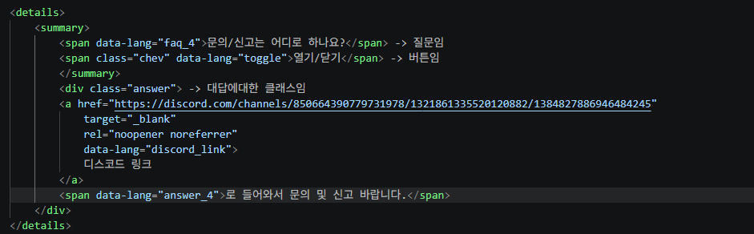
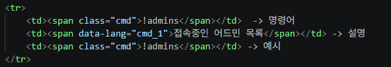

# RSS_MOTD
rss에서 사용하는 motd 웹페이지 파일로 현재는 정적 페이지로 구현.

한국어 , English , 日本語 , 中文으로 구현되어있음.

index.html = html 메인 html 파일(css 및 js 파일을 불러옴) 
style.css = html에서 웹페이지를 구현할때 배경을 만들어줌. (상자같은거) 
lang.js = 언어 파일 
script.js = 클립보드 , 열기/닫기 , 목록 등.. 버튼에대한 스크립트 구현 

추가 및 수정 시 참고사항
==============================================================

index.html 부분

양식만 지키면 쉬움
아래와 같은 주석 처리된 부분 아래쪽을 설정하면된다.

찾기목록 (index.html)[앞은 코드내부 주석 , 뒤는 무슨 기능에 들어가는것인지]
=======================

FAQ(Create) = 질문 및 답글 
마지막 업데이트 날짜 갱신(Update) = 단순 업데이트 날짜 갱신 
일반 사용자(Create) = 명령어리스트 
VIP(Create) = 명령어리스트 

보통 수정하면 건드려줘야되는 부분
=======================
lang.js , index.html

FAQ(Create) -> FAQ 부분
=======================

질문글을 추가할때 lang에서 위의 주석에서 코드에서 faq_4 처럼 해당되는 노드를 추가해주고 answer_4로 마찬가지로 구현해준다음에 위와같이 만들면됨.

마지막 업데이트 날짜 갱신(Update)
=======================
업데이트 마지막 날짜 갱신

일반 사용자(Create)
=======================
명령어 리스트 추가 (일반 사용자)

명령어 리스트를 추가할때 위와 같다. lang.js에 node를 추가해주고 cmd_1자리에 새로만든 노드를 넣어주면된다.

VIP(Create) 
=======================
명령어 리스트 추가 (VIP 사용자)

일반 사용자 명령어 리스트 추가와 같음

이미지파일을 넣는 방식은 index.html에서 경로를 그대로 따라간다. 현재사용중인 폴더 (guide_image)

파일 작동 방식
=======================

index.html(뼈대) <- lang.js(언어파일) , script.js(스크립트파일) , style.css(스타일) 
lang에선 문자를 가져오고 
script에선 기능을 가져오고 
style에선 생긴 스타일을 가져온다 
rss_motd에는 뼈대이기에 뼈에 장기붙인다는 느낌에 가까움 

